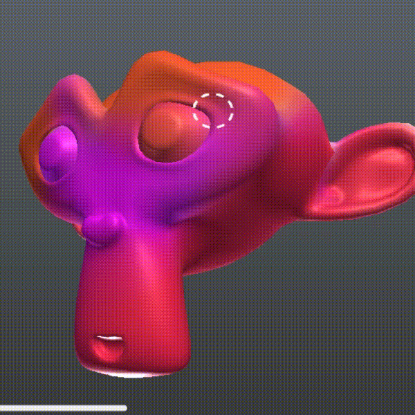

# Three JS Texture Paint

**⚠️WARNING! This addon is currently in development!⚠️**
**⚠️You may (will) find some issues ⚠️**




**USAGE**
```javascript
// Make a tp instance with params you need:
// Mesh you will paint on, raycaster and texture resolution
import { TexurePaint } from './texturePaint'
const tp = new TexurePaint(mesh, raycaster, 512); 
// To get texture:
let texture = tp.getTexture();
// To add brush marker on scene:
scene.add(tp.getMarker());
// To add event listeners:
tp.mouse("LEFT", document);
// You need to update tp in your render loop:
function animate(){
    tp.update();
}
// If you want to manualy stage history: 
tp.stage();
// To undo:
tp.undo(); 
```
